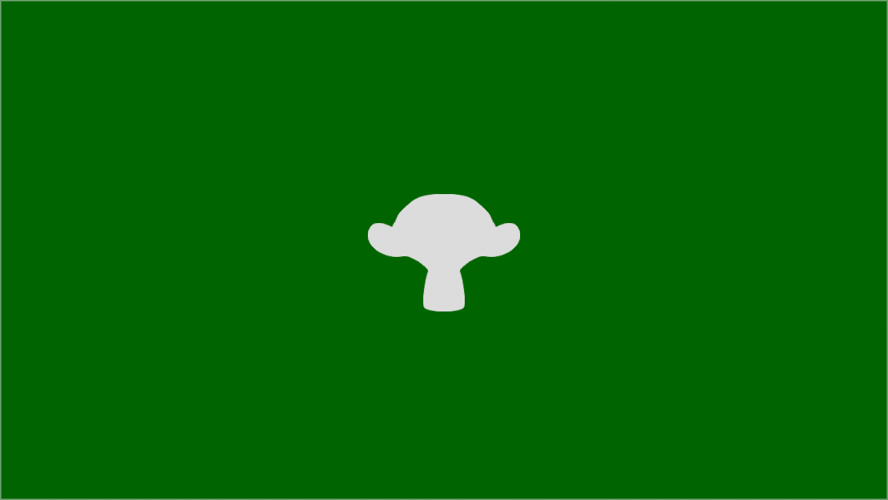

# Filament with GLFW

Filament is an amazing 3D rendering library started by
Google. This example shows how to use Filament with GLFW and my
feature-get-texture-id branch to use Filament with a shared
OpenGL context.

## Prerequisites

I assume that you have already setup a development environment
on both Linux and Windows. Some tools that you want to install:

- CMake
- Visual Studio 2019

## Building on Windows

With the current master branch (2020-06-02) I run into an issue
when I try to compile Filament. The paths that some of the
dependencies are too long. Currently you have to make sure to
clone this repository in e.g. `c:\tmp\` which I used while
testing. To build this example simply run `release.bat` from the
build directory; this will take care of everything and once
compiled you should see something as the image below.

    cd c:\
    git@github.com:roxlu/filament-with-glfw.git tmp
    
    cd tmp
    cd build
    release.bat
    

## Building on Linux

In this example I'm building the repository from a `tmp`
dir in your home. Similar to the Windows build I've provided
a `release.sh` file which you can run. Once Filament has
been compiled you'll see a something as in the image below.

    cd ~/
    git@github.com:roxlu/filament-with-glfw.git tmp
    
    cd tmp
    cd build
    ./release.sh
    

## Important

This example uses my `feature-get-texture-id` which allows you to
retrieve the native texture id from a `filament::Texture`. As
this example was created to show how to use a shared OpenGL
context it makes sense that we actually use some of the shared
resources.  See `test-shared-gl-context-with-fbo.cpp` where we
render the scene into a framebuffer and use the FBO texture in
our main OpenGL context.

## Creating a shared context

- Make sure that your main OpenGL context (e.g. the GLFW one) is
  not current when you create the `Filament::Engine` instance and
  pass the shared context into `filament::Engine::create()`
  
- When you pass a shared GL context, make sure to use the
  `filament::Engine::createSwapChain(int width, int height, int
  flags)` version which creates a *headless* swapchain. Note that
  there is also a `filament::Engine::createSwapChain(void*
  nativeWindow)` version.
  
- When passing a native window handle, use `glfwGetX11Window()`
  and **not** `glfwGetGLXWindow()` to retrieve the correct
  handle. You can directly cast these handles into a `void*`.
  
